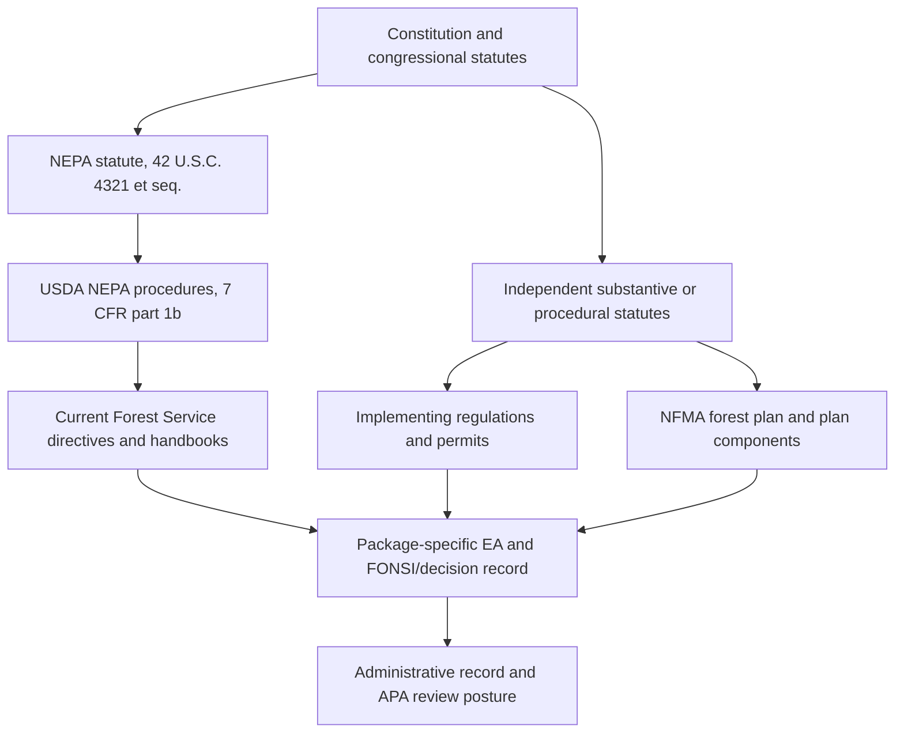
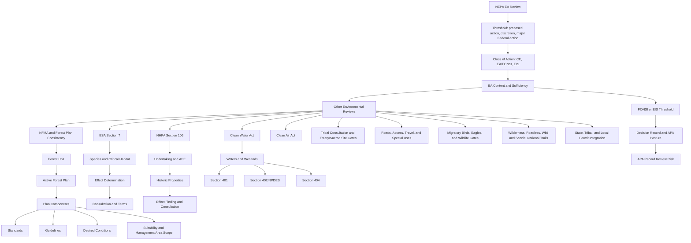

# NEPA EA Gate Graph Research Brief

Date: 2026-06-04
Status: research baseline for a future implementation milestone

## Purpose

This brief records the legal and process model behind a "Graph of Gates" for
Environmental Assessment (EA) review. The intended implementation pattern is:

```text
NEPA EA root gate
  -> authority-family gates
  -> authority-document gates
  -> subauthority, permit, consultation, scope, and forest-plan-component gates
  -> generated rule pack
  -> compliance review
```

Each node is an applicability gate. If a node is applicable, it opens its child
nodes. If it is not applicable, the child branch stays closed unless the system
finds contrary child-level trigger evidence that requires adjudication. This is
similar to a folder and subfolder system, but the runtime representation should
be a typed graph with currentness, provenance, trigger evidence, and validation
state.

This brief is not legal advice and should not be treated as a substitute for a
qualified NEPA, Forest Service, or agency counsel review. It is an
implementation-facing research artifact for this repository.

## Research Basis

Currentness matters because the Federal NEPA implementation landscape changed
materially in 2025 and 2026. This brief prioritizes current primary sources,
then current government training or digest material.

Official legal and regulatory anchors checked:

- NEPA section 102, 42 U.S.C. 4332:
  `https://uscode.house.gov/view.xhtml?req=granuleid:USC-prelim-title42-section4332&num=0&edition=prelim`
- NEPA level-of-review procedure, 42 U.S.C. 4336:
  `https://uscode.house.gov/view.xhtml?req=granuleid:USC-prelim-title42-section4336&num=0&edition=prelim`
- NEPA timely and unified reviews, 42 U.S.C. 4336a:
  `https://uscode.house.gov/view.xhtml?req=granuleid:USC-prelim-title42-section4336a&num=0&edition=prelim`
- NEPA programmatic document reliance, 42 U.S.C. 4336b:
  `https://uscode.house.gov/view.xhtml?req=granuleid:USC-prelim-title42-section4336b&num=0&edition=prelim`
- NEPA categorical exclusion adoption, 42 U.S.C. 4336c:
  `https://uscode.house.gov/view.xhtml?req=granuleid:USC-prelim-title42-section4336c&num=0&edition=prelim`
- NEPA definitions, 42 U.S.C. 4336e:
  `https://uscode.house.gov/view.xhtml?req=granuleid:USC-prelim-title42-section4336e&num=0&edition=prelim`
- USDA NEPA procedures, 7 CFR part 1b:
  `https://www.ecfr.gov/current/title-7/subtitle-A/part-1b`
- USDA final NEPA rule, 91 FR 17062, Apr. 3, 2026:
  `https://www.govinfo.gov/app/details/FR-2026-04-03/2026-06537`
- CEQ NEPA rulemaking status:
  `https://ceq.doe.gov/laws-regulations/regulations.html`
- DOE history page for CEQ NEPA regulations:
  `https://www.energy.gov/nepa/history-ceq-nepa-regulations-and-guidance`
- NFMA forest planning statute, 16 U.S.C. 1604:
  `https://uscode.house.gov/view.xhtml?req=granuleid:USC-prelim-title16-section1604&num=0&edition=prelim`
- Forest planning project consistency rule, 36 CFR 219.15:
  `https://www.ecfr.gov/current/title-36/chapter-II/part-219/section-219.15`
- ESA section 7, 16 U.S.C. 1536:
  `https://uscode.house.gov/view.xhtml?req=granuleid:USC-prelim-title16-section1536&num=0&edition=prelim`
- ESA section 7 consultation regulations, 50 CFR part 402:
  `https://www.ecfr.gov/current/title-50/chapter-I/subchapter-B/part-402`
- APA judicial review, 5 U.S.C. 706:
  `https://uscode.house.gov/view.xhtml?req=granuleid:USC-prelim-title5-section706&num=0&edition=prelim`
- Supreme Court, Seven County Infrastructure Coalition v. Eagle County,
  605 U.S. ___ (2025):
  `https://www.supremecourt.gov/opinions/24pdf/23-975_m648.pdf`

Training and government digest sources checked:

- EPA NEPA review process:
  `https://www.epa.gov/nepa/national-environmental-policy-act-review-process`
- EPA review under Clean Air Act section 309:
  `https://www.epa.gov/nepa/epa-review-process-under-section-309-clean-air-act`
- CEQ Citizen's Guide to NEPA page:
  `https://ceq.doe.gov/get-involved/citizens_guide_to_nepa.html`
- CEQ NEPA training provider page:
  `https://ceq.doe.gov/nepa-practice/training.html`
- ACHP NEPA and NHPA integration page:
  `https://www.achp.gov/integrating_nepa_106`
- DOE NEPA document type digest:
  `https://www.energy.gov/nepa/nepa-documents`
- FHWA NEPA classes of action digest:
  `https://www.environment.fhwa.dot.gov/nepa/classes_of_action.aspx`
- EPA Clean Water Act section 404 overview:
  `https://www.epa.gov/cwa-404/overview-clean-water-act-section-404`
- EPA Clean Water Act section 404 laws and related sections:
  `https://www.epa.gov/cwa-404/clean-water-laws-regulations-and-executive-orders-related-section-404`

## Current Legal Posture To Encode

The main currentness finding is that NEPA remains a controlling statute, but the
old government-wide CEQ regulations at 40 CFR parts 1500-1508 are no longer a
safe current controlling source. CEQ removed those regulations effective April
11, 2025, and CEQ's January 8, 2026 final rule adopted that removal without
change. CEQ and DOE retain historical pages, but those pages must be treated as
currentness or historical evidence unless a current agency procedure or statute
still incorporates the content.

USDA now has department-wide NEPA procedures in 7 CFR part 1b. USDA's April 3,
2026 final rule adopted the 2025 interim rule with changes and removed multiple
USDA agency-specific NEPA regulations, including the Forest Service rules that
had been at 36 CFR part 220. The practical consequence for this repo is:

- NEPA statute is the top procedural authority for NEPA review.
- USDA 7 CFR part 1b is the active USDA implementation layer.
- Forest Service-specific NEPA procedure must be checked against current USDA
  procedure, Forest Service directives, and any transition rule, not assumed
  from pre-2025/2026 36 CFR part 220.
- Forest Service planning, objection, and other rules outside 36 CFR part 220
  may still matter independently. For example, 36 CFR parts 218 and 219 remain
  separate gates when their triggers are present.
- Old CEQ and old Forest Service NEPA rule provisions can be useful training
  and history, but must be modeled as archived, superseded, rescinded, or
  currentness-only unless the source library proves current adoption.

This currentness layer is a required prerequisite for any Graph of Gates. The
graph cannot treat "has a source row" as "currently controls a review."

## NEPA Process Digest

NEPA is primarily procedural. It requires informed decision-making and public
disclosure before federal action, but it does not itself require the agency to
choose the most environmentally protective outcome. For EA review, the system
should model NEPA as the main container process that asks whether the agency
has enough reliable evidence and analysis to support a finding of no
significant impact or must proceed to an Environmental Impact Statement (EIS).

### Step 1: Agency action and NEPA threshold

The first gate asks whether there is a proposed agency action that is subject
to NEPA. Under 42 U.S.C. 4336 and 4336e, the system should check:

- whether there is a proposal at a stage where effects can be meaningfully
  evaluated;
- whether the action is a major Federal action under substantial federal
  control and responsibility;
- whether the action is final agency action for threshold purposes;
- whether the action is categorically excluded;
- whether another law excludes or conflicts with NEPA review;
- whether the agency has discretion to consider environmental factors.

For the repo's EA review posture, an EA package normally means the NEPA root
gate is already open. The system should still record the threshold because it
explains why the NEPA folder opened and which class-of-action branch was used.

### Step 2: Level of NEPA review

NEPA currently recognizes three practical levels of review:

- Categorical exclusion determination if a category of action normally does
  not significantly affect the human environment and no blocking condition
  applies.
- EA/FONSI path when significance is unknown or the action is not expected to
  have reasonably foreseeable significant effects.
- EIS/ROD path when the action requires an environmental document and has a
  reasonably foreseeable significant effect.

For EA review, the relevant root path is:

```text
major federal action or proposed action requiring review
  -> no CE or CE not used
  -> EA required or significance unknown
  -> EA analyzes purpose and need, alternatives if required, affected
     environment, impacts, consulted agencies/persons, and other reviews
  -> FONSI if no reasonably foreseeable significant impact
  -> EIS if significant effects are found
```

### Step 3: EA content

Under 7 CFR 1b.5, a USDA EA must focus on whether effects are significant and
must include, at minimum:

- purpose and need;
- no action, proposed action, and alternatives if required;
- potentially affected environment and environmental impacts;
- agencies and persons consulted;
- other environmental reviews and determinations for other applicable laws or
  regulations when the responsible official deems them necessary;
- page-limit and deadline certifications;
- a unique identification number.

This is important for gate design because "other environmental reviews" are not
random attachments. They are child folders inside the NEPA EA folder. ESA,
NHPA, CWA, CAA, NFMA, forest-plan consistency, and other gates may supply
effects analysis or determinations that inform the NEPA/FONSI decision.

### Step 4: Alternatives and purpose and need

The purpose-and-need gate drives the alternatives gate. Under current NEPA
statutory text and USDA procedure, alternatives analysis is not always a
free-floating requirement for every conceivable alternative. The system should
ask:

- What statutory or program authority defines the agency purpose and need?
- Is the agency reviewing an applicant proposal, and if so how does agency
  authority constrain the purpose and need?
- Are there unresolved conflicts concerning alternative uses of available
  resources?
- If conflicts were resolved through design criteria or proposal refinements,
  does the EA explain why additional alternatives were not developed?
- Does the analysis compare no-action consequences with action alternatives
  where needed?

This should become an applicability and sufficiency gate, not merely a text
search for a section titled "Alternatives."

### Step 5: Effects and significance

The effects gate should be tied to current authority text. NEPA section 102
requires analysis of reasonably foreseeable environmental effects, adverse
effects that cannot be avoided, alternatives, short-term versus long-term
productivity, and irreversible or irretrievable commitments. USDA 7 CFR part 1b
now defines significance as the degree of effects of the specific action on the
potentially affected environment and directs consideration of context such as
short- and long-term effects, public health and safety, economic effects, and
quality of life where appropriate.

Seven County reinforces a bounded scope model: the system should not assume
that every upstream, downstream, temporally separate, or geographically separate
project is automatically inside the NEPA effects gate. It should require a
reviewer-visible line-drawing explanation for what is inside and outside the
scope of analysis.

### Step 6: FONSI or EIS

A FONSI gate opens when the EA supports a determination that the proposed action
or selected alternative will not have a reasonably foreseeable significant
impact. Under 7 CFR 1b.6, a USDA FONSI must incorporate or reference the EA,
identify the selected alternative if alternatives were considered, explain why
an EIS is not needed, identify mitigation authority and monitoring or
enforcement provisions if mitigation supports the no-significant-impact
finding, state anticipated implementation timing, and include the responsible
official's signature/date.

If the EA finds reasonably foreseeable significant effects, the EIS gate opens.
EIS review then becomes a different root branch with Notice of Intent, draft
EIS, final EIS, ROD, timing, public-comment, and EPA filing/review gates.

## Authority Hierarchy

The Graph of Gates should distinguish legal hierarchy from review workflow.
NEPA is the main file for an EA review, but NFMA, ESA, CWA, NHPA, APA, and
other authorities are not legally "inside" NEPA in a supremacy sense. They are
independent statutes, regulations, directives, permits, consultations, and
review doctrines that NEPA can integrate into one environmental review record.

The core hierarchy should be modeled like this:



Implementation meaning:

- `IMPLEMENTS`: USDA 7 CFR part 1b implements NEPA for USDA subcomponents.
- `INTERPRETS`: current agency handbooks or directives may interpret statute or
  regulation, if current.
- `RESCINDS` or `SUPERSEDES`: CEQ rescission and USDA 2026 rule currentness
  edges must keep obsolete 40 CFR and 36 CFR 220 assumptions out of active
  review.
- `REQUIRES_CONSISTENCY_WITH`: project, permit, contract, plan component, or
  generated rule must remain consistent with the higher-level authority.
- `GOVERNS_FOREST_UNIT`: a forest plan or unit-specific directive applies only
  inside a defined forest-unit scope.
- `APPLIES_WITHIN_SCOPE`: authority or component applies only when geographic,
  resource, activity, species, water, cultural, or permit triggers are present.
- `INCORPORATES_BY_REFERENCE`: EA or forest-plan component can invoke a
  supporting document, appendix, analysis, map, or biological/historic/cultural
  review.

## Major Child Folders Under NEPA EA

The first graph implementation should represent these as authority-family
folders, not as hard-coded Python branches.

### NEPA procedural folder

Purpose: decide whether the EA itself meets NEPA and USDA procedural gates.

Representative gates:

- proposed action and agency discretion;
- class of action;
- purpose and need;
- alternative uses and alternatives;
- affected environment;
- effects and significance;
- agencies and persons consulted;
- other environmental reviews;
- page and timing certifications;
- FONSI or EIS threshold;
- mitigation authority and monitoring if mitigation supports the FONSI;
- record integrity for final decision.

### NFMA and forest-plan consistency folder

Purpose: determine whether the project must be consistent with the governing
land management plan and which plan components apply.

NFMA requires land and resource management plans for National Forest System
units. NFMA also requires resource plans, permits, contracts, and other
instruments for use and occupancy of National Forest System lands to be
consistent with the land management plans. The planning rule at 36 CFR 219.15
is the current project and activity consistency surface.

Gate chain:

```text
National Forest System lands or Forest Service authorization
  -> governing forest unit identified
  -> active forest plan identified
  -> plan components and scope overlays loaded
  -> management area, geographic area, species, watershed, road, recreation,
     vegetation, wilderness, and other component scopes evaluated
  -> applicable standards/guidelines/desired conditions/suitability components
     opened
  -> consistency finding or unresolved component gap
```

For this repo, this is the most mature branch because existing source-set
inventory work already treats forest plan components as candidate authorities.
The Graph of Gates should preserve that detail rather than collapsing NFMA to
one yes/no flag.

### ESA section 7 folder

Purpose: determine whether the federal action may affect listed species or
designated critical habitat and whether consultation is required.

Gate chain:

```text
federal action
  -> action area
  -> listed/proposed species or critical habitat may be present
  -> no effect, may affect not likely to adversely affect, or likely to
     adversely affect path
  -> informal or formal consultation
  -> biological assessment or biological opinion if required
  -> incidental take statement and terms/conditions if required
  -> section 7(d) resource-commitment limitation while consultation is pending
```

ESA is not merely a NEPA topic. It is an independent statutory gate that can
inform NEPA effects analysis and can also impose consultation and action
constraints.

### NHPA section 106 folder

Purpose: determine whether the action is an undertaking with potential effects
on historic properties.

Gate chain:

```text
federal undertaking
  -> area of potential effects
  -> historic properties identified or survey needed
  -> no historic properties affected, no adverse effect, or adverse effect
  -> consultation with SHPO/THPO, tribes, consulting parties, and ACHP when
     required
  -> avoidance, minimization, mitigation, agreement document, or unresolved gap
```

ACHP's current guidance emphasizes that NEPA and Section 106 are independent
but can be integrated. That is exactly how the Graph of Gates should work:
same review graph, separate authority gates.

### CWA folder

Purpose: determine whether water-quality certification, discharge permitting,
or dredge/fill authorization is triggered.

Gate chain:

```text
waters, wetlands, discharge, dredge/fill, stormwater, road/stream work, or
aquatic resource trigger
  -> CWA section 401 certification if a federal license or permit may result in
     discharge to waters of the United States
  -> CWA section 402/NPDES if pollutant discharge point-source coverage is
     required
  -> CWA section 404 if discharge of dredged or fill material into waters of
     the United States is involved
  -> mitigation, best management practices, permit conditions, or unresolved
     jurisdiction/permit gap
```

The CWA branch should be resource and activity triggered. A watershed analysis
alone should not open every CWA permit gate.

### CAA folder

Purpose: determine whether Clean Air Act review obligations affect the NEPA
record.

Gate chain:

```text
air emissions, smoke, dust, conformity area, major federal EIS, or regulated
source trigger
  -> general conformity or other CAA gate if triggered
  -> EPA section 309 review gate for draft EISs and certain major federal
     actions
  -> mitigation, comments, or referral risk if unresolved
```

For an EA, the EPA section 309 branch is usually not a full EIS review gate,
but the CAA family can still matter for emissions, smoke, conformity, and
record adequacy.

### APA and administrative-record folder

Purpose: determine whether the final decision is supported by a reasoned,
record-backed explanation that can survive arbitrary-and-capricious review.

Gate chain:

```text
final agency action or decision document
  -> cited record evidence
  -> reasoned explanation
  -> response or consideration of required comments/consultation
  -> no unexplained contradiction with record evidence
  -> no missing procedure required by statute/regulation
```

APA is not a resource gate. It is the judicial-review posture gate. The Graph
of Gates should expose unresolved record gaps because many NEPA, NFMA, ESA,
NHPA, and CWA weaknesses become litigation risk through APA review.

### Other recurrent Forest Service EA folders

These should start as candidate family gates and open only when package facts
or source-set candidates support them:

- wilderness and wilderness study areas;
- wild and scenic rivers;
- inventoried roadless areas and roadless rules;
- national trails and scenic/recreation corridors;
- travel management and roads/access;
- special uses, rights-of-way, recreation residences, outfitting/guiding, ski
  areas, utilities, and communications sites;
- vegetation, timber, fuels, wildfire, prescribed fire, salvage, and insect or
  disease response;
- grazing and rangeland permits;
- minerals, oil, gas, geothermal, and locatable/leasable minerals;
- migratory birds, eagles, and other wildlife-specific authorities;
- invasive species and noxious weeds;
- floodplains and wetlands;
- tribal consultation, treaty rights, sacred sites, and cultural resources;
- hazardous materials, CERCLA/RCRA-like cleanup or contamination concerns;
- state, tribal, and local permits when integrated into the federal review
  record.

## Gate Graph Semantics

The graph should separate these concepts:

- `candidate`: the authority exists in the authority universe for this review.
- `applicable`: package facts and source evidence show the authority applies.
- `not_applicable`: evidence and coverage support closing the gate.
- `unresolved`: evidence is missing, stale, contradictory, or insufficient.
- `needs_adjudication`: deterministic rules found a conflict that requires a
  reviewer decision.
- `active`: a gate is open because it is applicable or because an ancestor is
  open and the child must be evaluated.
- `blocked`: a downstream gate cannot be evaluated because an ancestor or
  required source is unresolved.
- `current`: the authority expression is current for review use.
- `historical_or_archived`: the source can explain lineage but cannot control a
  current review.

Applicability and currentness are different gates. A rescinded regulation can
be relevant as history but not applicable as current controlling law. A current
authority can be not applicable because the package lacks the trigger facts.

Recommended node fields:

```json
{
  "gate_id": "nepa_ea.nfma.forest_plan.components.standard_xyz",
  "node_type": "forest_plan_component_gate",
  "authority_family_id": "nfma_forest_plan_consistency",
  "authority_document_id": "forest_plan:custer_gallatin",
  "authority_fragment_id": "forest_plan_component:standard_xyz",
  "parent_gate_ids": ["nepa_ea.nfma.forest_plan.components"],
  "status": "applicable",
  "currentness_status": "current",
  "activation_state": "open",
  "required_package_fact_types": ["forest_unit", "activity", "resource_scope"],
  "positive_trigger_groups": [],
  "negative_trigger_groups": [],
  "source_evidence_requirements": [],
  "coverage_certificate_id": "coverage:...",
  "decision_id": "applicability_decision:...",
  "authority_path_id": "authority_path:...",
  "review_visibility": "reviewer_visible"
}
```

Recommended edge fields:

```json
{
  "edge_id": "edge:usda_1b_implements_nepa",
  "source_gate_id": "nepa_ea.usda_7_cfr_1b",
  "relationship_type": "IMPLEMENTS",
  "target_gate_id": "nepa_ea",
  "evidence_basis_type": "currentness_adjudicated",
  "supporting_source_record_ids": [],
  "relationship_basis": "USDA 7 CFR part 1b is the current USDA NEPA procedure layer."
}
```

## Starter Gate Tree For USFS EA Reviews

This is the first-pass "folder" view. Implementation should store it as graph
data rather than a nested dict that cannot represent cross-links.



## Applicability Decision Rules

Recommended default rules:

- The NEPA EA root is open for any package that is explicitly an EA package.
- Child authority-family gates open only when package facts or source-set
  candidates indicate possible applicability.
- A parent gate marked not applicable closes child gates only when coverage
  requirements are satisfied.
- A child gate with strong positive evidence under a closed parent creates
  `needs_adjudication`, not silent reopening.
- Missing current source evidence creates `unresolved`, not `not_applicable`.
- Old CEQ or 36 CFR 220 evidence cannot make a gate current unless a
  currentness relationship explicitly adopts or preserves it.
- Forest-plan component gates must stay component-level. A forest plan being
  applicable does not automatically make every standard or guideline
  applicable.
- ESA, NHPA, CWA, and similar gates should not open merely because the EA has a
  generic resource section. They need activity, geography, species, waters,
  undertaking, permit, or resource-trigger facts.
- Compliance review must not decide applicability. It consumes validated
  applicable gates and generated rules.

## Repo Implementation Implications

The repo already has the right architectural direction:

- `docs/APPLICABILITY_FIRST_REVIEW_MILESTONE_PLAN.md` establishes that
  applicability happens before compliance review.
- `docs/AUTHORITY_ONTOLOGY_STARTER.md` separates authority family, authority
  document/version, fragment/component, source record/artifact/evidence span,
  and review reasoning object.
- `config/authority_relationship_types_v1.json` already contains relationship
  types needed for a legal/policy graph.
- `config/authority_relationship_register_v1.json` currently has no promoted
  runtime rows, only starter examples.

Recommended next milestone:

1. Add a non-runtime schema for `applicability_gate_graph_nepa_ea_v1`.
2. Add a curated starter NEPA EA gate tree that binds to authority family IDs
   but does not claim full currentness until source records are mapped.
3. Add currentness rows for CEQ rescission, USDA 7 CFR part 1b, 36 CFR part 220
   reserved/rescinded status, and the Forest Service directive path.
4. Add a graph export that joins authority universe candidates,
   applicability decisions, coverage certificates, and authority relationship
   paths.
5. Add validation gates:
   - no active gate can depend on a non-current controlling authority;
   - every open child gate must have an open or adjudicated parent path;
   - every applicable authority must map to at least one gate path;
   - every generated rule must link back to an applicable gate;
   - every not-applicable gate must have a coverage certificate or explicit
     negative trigger support;
   - old CEQ/36 CFR 220 citations must be currentness-only unless promoted
     through a current source relationship.

Do not implement this by adding NEPA-specific branching to the compliance
reviewer. The graph should be data-backed and should feed the existing
applicability-first pipeline.

## Open Hazards

- Currentness drift: agency procedures are changing. Any implementation
  milestone should re-check 7 CFR part 1b, Forest Service directives, and
  Federal Register transition rules at the start of work.
- Archived guidance contamination: old CEQ training and old Forest Service
  36 CFR part 220 materials can explain the process but may no longer control
  a current review.
- Overopening gates: treating every law mentioned in an EA as applicable will
  flood the rule pack and degrade review quality.
- Overclosing gates: treating lack of a keyword as not applicable will miss
  triggered consultations or permits.
- Forest-plan flattening: NFMA review must preserve forest unit, active plan,
  management/geographic area, and component-level applicability.
- Legal hierarchy confusion: NEPA can integrate other reviews, but those laws
  often remain independent sources of duty.
- APA afterthought risk: many substantive-looking gaps are ultimately record
  and reasoned-explanation risks under APA review.

## Working Conclusion

The user's folder metaphor is correct as a reviewer mental model, but the
runtime should be a typed gate graph:

- NEPA is the root review container for EA packages.
- USDA and Forest Service procedures are current implementation gates under
  NEPA.
- NFMA, ESA, NHPA, CWA, CAA, APA, and related authorities are child folders in
  the NEPA review workflow, but they remain independent legal authorities.
- Each child folder has subfolders whose applicability is determined from
  package facts, source-set candidates, current authority evidence, retrieval
  traces, graph traces, and coverage certificates.
- The graph opens only what is applicable, preserves what is not applicable,
  and fails closed on unresolved or stale currentness.

The next implementation should promote this from research into a non-runtime
gate graph contract before any runtime applicability behavior changes.
